# day20-html_css

# 今日内容

- html的语法规则
- html常用的标签----重点\掌握
- css介绍
- css选择器和常用属性----重点\掌握

# 第一章-HTML入门

## 1.1 HTML介绍

#### 什么是html

​	超文本标记语言(**H**yper **T**ext **M**arkup **L**anguage)，标准通用标记语言下的一个应用。HTML 不是一种编程语言，而是一种标记语言，是**网页制作**所必备的。

​	超文本：功能比文本强大, 就是指页面内可以包含图片、链接，甚至音乐、程序等非文字元素。

​	标记语言: 语法由标签组成

> 学习HTML的核心是标签


#### html可以做什么

​	设计页面,做网页


## 1.2 HTML结构和基本语法

#### HTML的结构

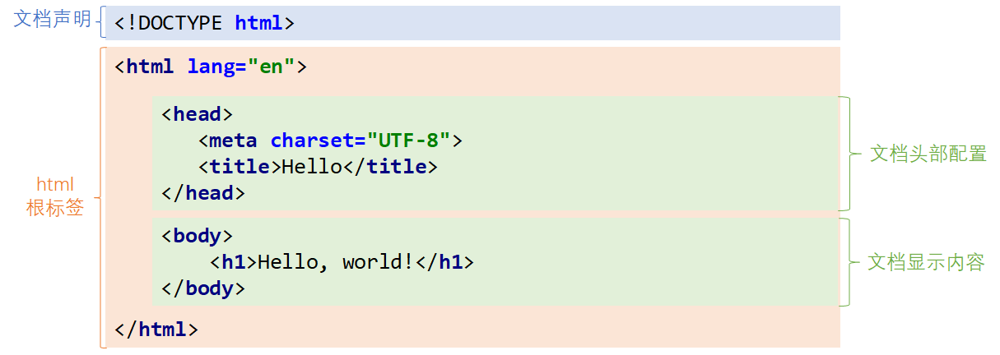

* 文档结构介绍：

  * 文档声明：用于声明当前HTML的版本，这里的`<!DOCTYPE html>`是HTML5的声明
  * html根标签：除文档声明以外，其它内容全部要放在根标签html内部
  * 文档头部配置：head标签，是当前页面的配置信息，外部引入文件, 例如网页标签、字符集等
  * 文档显示内容：body标签，里边的内容会显示到浏览器页面上

  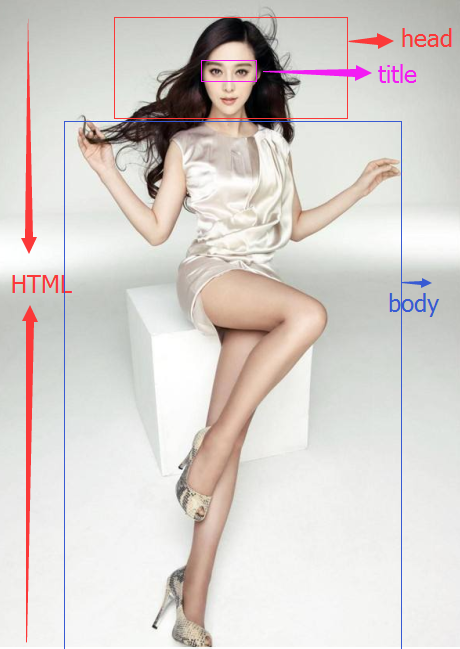 


#### HTML语法规范

- 扩展名是html或者htm


- html标签不区分大小写


- html由头(head)和体(body)组成 
- 标签是可以嵌套的,标签里面可以放标签  


- 标签一般由起始标签开始，结束标签终止(成对出现)。但是如果标签不修饰内容，可以在标签里结束.  
- <标签名/> 空标签

#### 标签属性

- 属性是属于标签的，修饰标签，让标签有更多的效果
- 属性一般定义在起始标签里面。 

- 属性一般以 **属性名=属性值**的形式存在
- 属性值一般用 `''` 或者`“ ”` 括起来。 不加引号也是可以的.(不建议使用)


## 1.3 HTML快速入门

#### 使用idea创建static web项目

1. File -> new -> Module

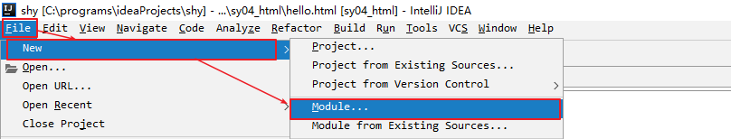

2. 选择static web

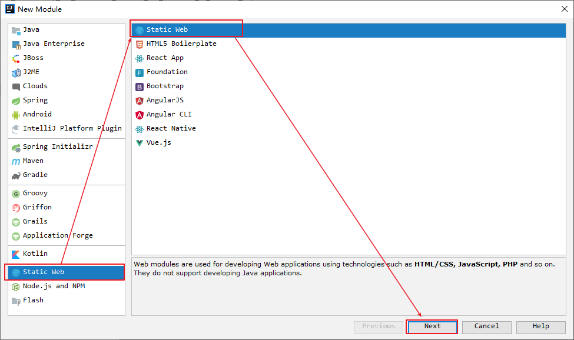

3. 设置Module的名称

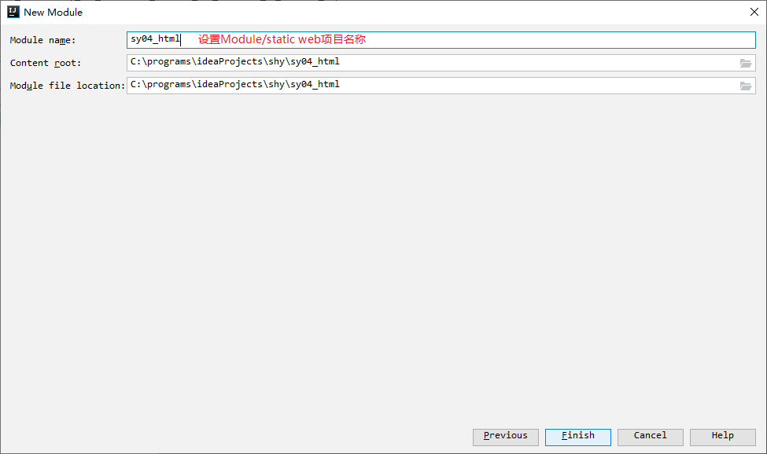

####  创建html文件

1. 在static web项目上右键 -> New -> Html File

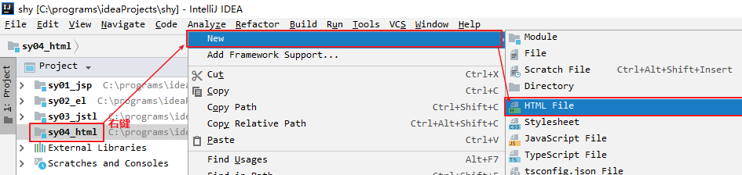

2. 设置HTML文件名称

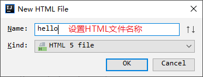

#### 编写HTML代码

```html
<!DOCTYPE html>
<html lang="en">
<head>
    <meta charset="UTF-8">
    <title>01_快速入门</title>
</head>
<body>
<font color="red" size="5" face="微软雅黑">hello world...</font>
</body>
</html>
```

#### 使用浏览器访问

1. 把鼠标移动到右上角，会浮动出来浏览器按钮，点击“Chrome”按钮，使用Chrome浏览器打开当前网页

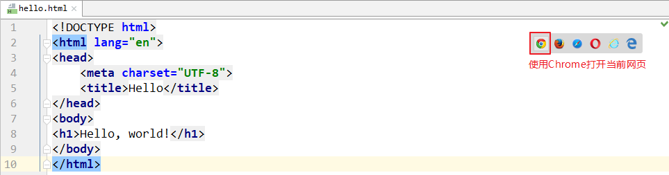

2. 在浏览器上看到效果

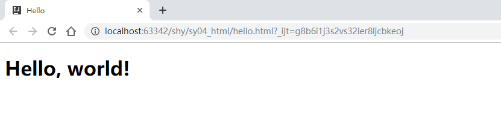

# 第二章-HTML常用的标签

## 练习-公司简介

### 1. 目标

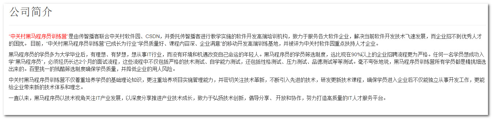

### 2. 路径

1. 学习文字排版相关的标签
   1. 字体标签
   2. 标题标签
   3. 下划线标签
   4. 段落和换行
   5. 粗体和斜体标签
2. 使用文字排版标签，完成公司简介

### 3. 实现

#### 3.1.排版标签

```html
<!DOCTYPE html>
<html lang="en">
<head>
    <meta charset="UTF-8">
    <title>01_文字排版标签</title>
</head>
<body>
<!--添加或取消注释: ctrl+/  ctrl+shift+/-->
<!--字体标签: font   size属性:字体大小(1-7)  color属性:颜色(单词,十六进制的颜色代码) face属性:字体样式-->
<font size="1" color="Pink" >字体标签1</font>
<font size="2">字体标签2</font>
<font size="3">字体标签3</font>
<font size="4">字体标签4</font>
<font size="5">字体标签5</font>
<font size="6">字体标签6</font>
<font size="7" color="#FFC0CB" face="楷体">字体标签7</font>
<font size="8">字体标签8</font>

<!--换行标签: br-->
<br/>

<!--粗体标签: b   斜体: i-->
<font><b>粗体标签</b></font>
<font><i>斜体标签</i></font>
<br/>

<!--标题标签: hn   n的取值范围: 1-6-->
<h1>标题1</h1>
<h2>标题2</h2>
<h3>标题3</h3>
<h4>标题4</h4>
<h5>标题5</h5>
<h6>标题6</h6>
<h7>标题7</h7>
<h8>标题8</h8>

<!--下划线: hr-->
<hr/>

<!--段落标签: p  会自动换行-->
<p>“中关村黑马程序员训练营”致力于服务各大软件企业，解决当前软件开发技术飞速发展，而企业招不到人才的困扰。“中关村黑马程序员训练营”已成长为行业“学员质量最好、课程内容最深、企业最满意”的3G移动开发高端训练基地，并被评为中关村软件园重点扶持人才企业。</p>
<p>黑马程序员所有学员均是大学毕业后，有理想、有梦想，想从事IT行业，而没有环境和机遇改变自己命运的年青人。黑马程序员的学员筛选制度，远比很多90%以上的企业招聘流程更为严格。</p>
</body>
</html>
```


#### 3.2 公司简介练习

**思路**

1. 创建HTML
2. 创建标题标签
3. 创建下划线标签
4. 创建4个段落标签
5. 在第一个段落的前面文字, 嵌套font标签 ,设置color=red

**实现**

```html
<!DOCTYPE html>
<html>
	<head>
		<meta charset="UTF-8">
		<title></title>
	</head>
	
	<!--1.创建一个html页面
	2.创建一个标题标签
	3.创建一个下滑线标签
	4.创建4个段落标签
	5.在第一个段落前面几个文字,嵌套一个font标签,设置color属性为red-->
	<body>
		<h1>公司简介</h1>
		<hr />
		<p><font color="red">“中关村黑马程序员训练营”</font>是由传智播客联合中关村软件园、CSDN，并委托传智播客进行教学实施的软件开发高端培训机构，致力于服务各大软件企业，解决当前软件开发技术飞速发展，而企业招不到优秀人才的困扰。 目前，“中关村黑马程序员训练营”已成长为行业“学员质量好、课程内容深、企业满意”的移动开发高端训练基地，并被评为中关村软件园重点扶持人才企业。</p>
		<p>黑马程序员的学员多为大学毕业后，有理想、有梦想，想从事IT行业，而没有环境和机遇改变自己命运的年轻人。黑马程序员的学员筛选制度，远比现在90%以上的企业招聘流程更为严格。任何一名学员想成功入学“黑马程序员”，必须经历长达2个月的面试流程，这些流程中不仅包括严格的技术测试、自学能力测试，还包括性格测试、压力测试、品德测试等等测试。毫不夸张地说，黑马程序员训练营所有学员都是精挑细选出来的。百里挑一的残酷筛选制度确保学员质量，并降低企业的用人风险。</p>
		<p>中关村黑马程序员训练营不仅着重培养学员的基础理论知识，更注重培养项目实施管理能力，并密切关注技术革新，不断引入先进的技术，研发更新技术课程，确保学员进入企业后不仅能独立从事开发工作，更能给企业带来新的技术体系和理念。</p>
		<p>一直以来，黑马程序员以技术视角关注IT产业发展，以深度分享推进产业技术成长，致力于弘扬技术创新，倡导分享、 开放和协作，努力打造高质量的IT人才服务平台。</p>
		
	</body>
</html>
```

### 4. 小结

1. 标题标签

```
<hn></hn>   n取值1~6
```

2. 段落标签  段落之间自动进行换行

```
<p></p>
```

3. 粗体标签

```
<b></b>
```

4. 斜体标签

```
<i></i>
```

5. 换行标签

```
<br/>
```

6. 下划线标签

```
<hr/>
```


## 练习-图片显示

### 1. 目标

 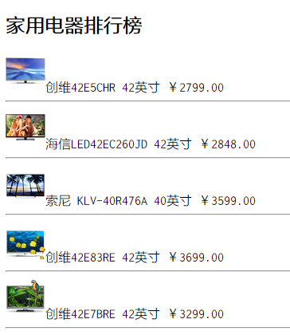


### 2. 分析

* 图片的格式有很多种，例如：`.jpg`, `.jpeg`, `.png`, `.gif`等等
* 在html里，所有图片都使用标签``来显示

### 3. 实现

#### 3.1图片标签

+ img标签中的img其实是英文image的缩写, img标签的作用, 就是告诉浏览器我们需要显示一张图片

```html
语法:

```

+ 示例代码

```html
<!DOCTYPE html>
<html lang="en">
<head>
    <meta charset="UTF-8">
    <title>01_图片标签</title>
</head>
<body>
<!--图片标签: img -->
<!--src:图片的路径 width:宽度(像素px,百分比)  height:高度(像素px,百分比) -->
<!--单位百分比:相对于父标签的百分比-->
<!--title:提示信息(当鼠标悬停在图片上提示的内容)-->
<!--alt:提示信息(当图片显示不出来的时候,显示的提示信息)-->
<br/>

</body>
</html>
```

#### 3.2.路径问题

- 绝对路径:以盘符开始的完整路径
- 相对路径:相对当前的html文件路径    ../ 表示上一层路径   ./表示当前路径
- 绝对路径注意点:
  - 路径中不要出现中文, 否则可能出现未知问题
  -  IDEA不能直接访问, 进入磁盘之后再访问是可以的

```java
<!DOCTYPE html>
<html lang="en">
<head>
    <meta charset="UTF-8">
    <title>02_路径问题</title>
</head>
<body>
<!--
- 绝对路径:以盘符开始的完整路径
- 相对路径:相对当前的html文件路径    ../ 表示上一层路径   ./表示当前路径
- 绝对路径注意点:
  - 路径中不要出现中文, 否则可能出现未知问题
  - IDEA不能直接访问, 进入磁盘之后再访问是可以的
-->
<!--相对路径-->

<!--绝对路径-->


</body>
</html>
```


#### 3.3案例实现

##### 3.3.1步骤

1. 创建HTML
2. 创建标题标签
3. 创建图片标签, 创建文本, 创建下划线标签
4. 复杂4个

##### 3.3.2实现

```html
<!DOCTYPE html>
<html lang="en">
<head>
    <meta charset="UTF-8">
    <title>案例二图片展示</title>
</head>
<body>
    <!--- 创建标题标签
        - 创建一个图片标签, 创建font标签, 创建下划线标签(复制4个)
    -->
    <h1>家用电器排行</h1>
     <font size="3">TCL电视, 品质保障</font>
    <hr/>
     <font size="3">TCL电视, 品质保障</font>
    <hr/>
     <font size="3">TCL电视, 品质保障</font>
    <hr/>
     <font size="3">TCL电视, 品质保障</font>
    <hr/>
     <font size="3">TCL电视, 品质保障</font>
    <hr/>

</body>
</html>
```

### 4. 小结 

1. 图片标签

```

```

2. 路径问题
   + 绝对路径(以http开始的, 以盘符开始的)
   + 相对路径
     + ./    当前目录
     + ../  上级目录


## 练习-友情链接

### 1. 目标


- 点击百度，进入百度页面....

### 2. 路径

1. 列表标签

2. 超链接标签

3. 完成友情链接的练习

### 3. 实现

#### 3.1 列表标签

##### 3.1.1无序列表

- 语法

```
<ul type="类型">
    <li>需要显示的条目内容</li>
    ...
</ul>
 <!--type属性: 列表的类型; circle: 空心圆; square: 实心的正方形-->
```

- 示例代码

```html
    <!--二 无序列表 ul-->
    <!--type属性: 列表的类型; circle: 空心圆; square: 实心的正方形-->
    <ul type="square">
        <!--li定义列表里面的条目(item). li定义在ul里面-->
        <li>乔丹</li>
        <li>詹姆斯</li>
        <li>艾弗森</li>
        <li>科比</li>
        <li>库日天</li>
    </ul>
```

- 注意点

  ​	 ul标签和li标签是一个整体,一般情况下ul标签和li标签都是一起出现, 不会单个出现.

  ​	 li要定义在ul里面

- 应用场景

  ​	新闻列表
  ​	商品列表
  ​	导航条,菜单

##### 3.1.2有序列表

- 语法

```html
有序列表 ol
start属性: 起始的索引(默认是第1个)
type属性: 列表类型;  1: 阿拉伯数字; a: 小写的英文字母; A:大写的英文字母; i: 小写的罗马数字; I:大写的罗马数字
```

+ 示例代码

```html
    <ol start="1" type="1">
        <!--li定义列表里面的条目(item). li定义在ol里面-->
        <li>乔丹</li>
        <li>詹姆斯</li>
        <li>艾弗森</li>
        <li>科比</li>
        <li>库日天</li>
    </ol>
```

#### 3.2.超链接标签

##### 3.2.1超链接标签的基本使用

+ 超链接标签的作用: 就是用于控制页面与页面(服务器资源)之间跳转的

```
超链接标签的格式:
		<a href="指定需要跳转的目标路径" target="打开的方式">需要展现给用户查看的内容</a>
		target属性取值: 
            _blank：新起页面
            _self：当前页面（默认）
```

+ 示例代码

```html
    <!--href属性: 跳转的路径(可以是本地的也可以是远程的)
        target属性: 链接打开方式; _blank: 新开一个窗口;_self:在当前页面打开(默认值)
    -->

    <a href="http://www.baidu.com" target="_self">百度</a>
    <a href="../案例一信息展示案例/index.html">案例一信息展示页面</a>
```

##### 3.2.2假链接

​	就是点击之后不会跳转的链接我们称之为假链接.在企业开发前期, 其它界面都没有写出来, 那么我们就不知道应该跳转到什么地方, 所以就只能使用假链接来代替. 当项目后期其它界面都已经完成时再将假链接体会为真链接

```html
<a href="#">这是一个假链接</a>
```

#### 3.3 友情链接练习

**思路**

1. 创建标题标签
2. 创建无序列表
3. 在无序列表里面定义三个li
4. 再在每一个li里面定义a


**实现**

```html
<!DOCTYPE html>
<html lang="en">
<head>
    <meta charset="UTF-8">
    <title>Title</title>
</head>
<body>
<!--1.创建标题标签-->
<h1>友情链接</h1>
<!--2.创建无序列表标签,列表项设置为实心方块-->
<ul type="square">
    <!--3.在3个列表项中嵌套超链接标签-->
    <li><a href="http://www.baidu.com" target="_blank">百度</a></li>
    <li><a href="http://www.itcast.com" target="_blank">传智</a></li>
    <li><a href="http://www.itheima.com" target="_blank">谷歌</a></li>
</ul>
</body>
</html>
```

### 4. 小结

1. 列表标签

   + 无序列表

   ```html
   <ul type="circle\square\默认实心圆">
   	<li></li>
   </ul>
   ```

   

   + 有序列表

   ```html
   <ol type="" start="">
   	<li></li>
   </ol>
   ```

   > li定义ol或者ul里面 内容定义在li里面

2. 超链接标签

   ```html
   <a href="" target="打开方式">文本</a>
   
   target取值:
   	_self  当前窗口打开【默认】
   	_blank 新开一个窗口
   ```

   


## 练习-黑马旅游首页

### 1. 目标

* 能够编写黑马旅游首页

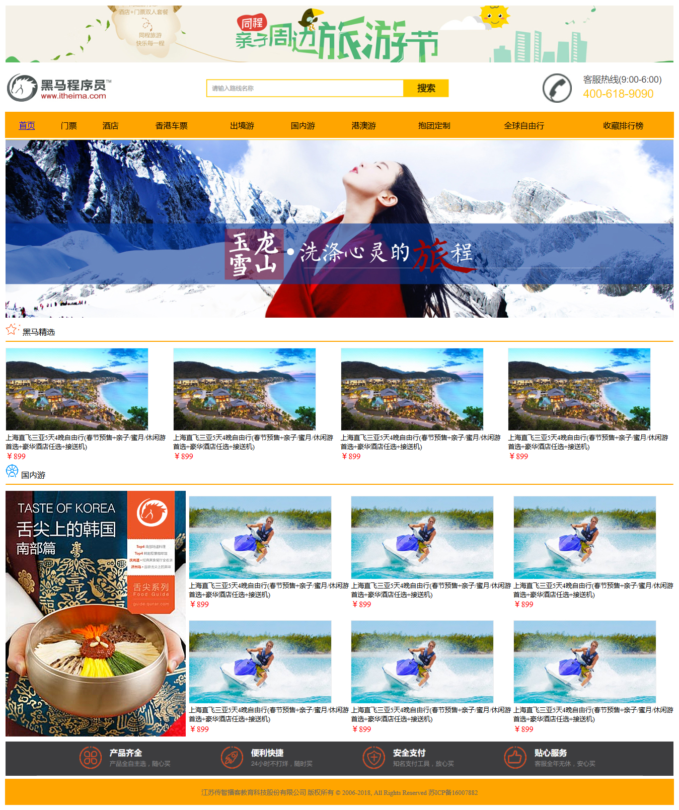

### 2. 步骤

1. 学习表格标签
2. 完成黑马旅游首页的练习

### 3. 实现

#### 3.1 表格标签

##### 3.1.1 基本表格

###### 语法

* 表格：由`<table>`标签定义；
* 行：每个表格里有若干行`<tr>`；
* 单元格：每行被分割为若干单元格`<td>`。
  * 单元格里可以包含文本、图片、列表、段落、表单、水平线、表格等

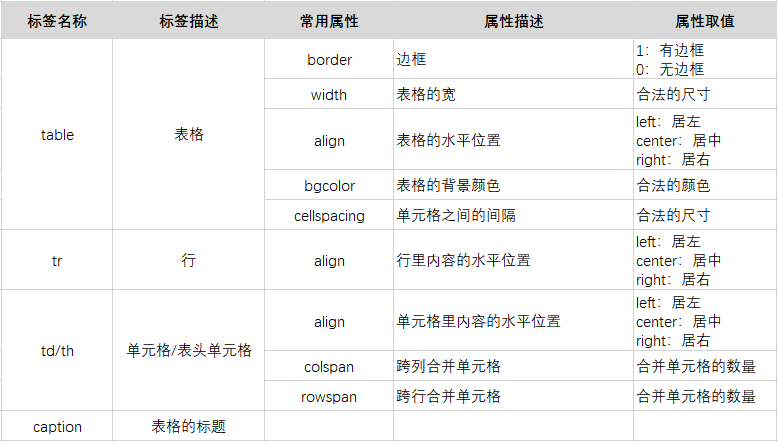

```html
<!DOCTYPE html>
<html lang="en">
<head>
    <meta charset="UTF-8">
    <title>01_表格标签</title>
</head>
<body>
<!--表格标签: table-->
<!--行标签: tr-->
<!--单元格标签: td-->
<!--注意:单元格里可以包含文本、图片、列表、段落、表单、水平线、表格等-->
<!--关系:table标签中嵌套tr标签,tr标签中嵌套td标签-->
<!--快捷键: table>tr*行的数量>td*列的数量 tab键-->
<!--eg:创建一个4行5列的表格-->
<!--
    table标签的属性:
         border:1表示有边框(像素), 0表示没有边框
         width: 宽度(像素,百分比)
         height:高度(像素,百分比)
         align:对齐方式  center:居中对齐  left:左对齐(默认)  right:右对齐
         cellspacing(了解):单元格和单元格之间的间隙
         cellpadding(了解):单元格内容和单元格之间的间隙
         bgcolor: 背景颜色(颜色单词,十六进制的颜色代码)
    tr标签属性:align:对齐方式  center:居中对齐  left:左对齐(默认)  right:右对齐
    td标签属性:align:对齐方式  center:居中对齐  left:左对齐(默认)  right:右对齐
              colspan: 合并列
              rowspan: 合并行
    th标签: 表示表头标签(默认居中对齐,自动加粗)
    caption标签: 设置表名(默认居中对齐)
-->
<table border="1" width="50%" align="center" >
    <caption>学生信息表</caption>
    <tr>
        <th>学号</th>
        <th>姓名</th>
        <th>性别</th>
        <th>学科</th>
        <th>总成绩</th>
    </tr>
    <tr align="center">
        <td>1</td>
        <td>张三</td>
        <td>男</td>
        <td>java</td>
        <td>100</td>
    </tr>
    <tr  align="center">
        <td>2</td>
        <td>李四</td>
        <td>女</td>
        <td>java</td>
        <td>90</td>
    </tr>
    <tr  align="center">
        <td>2</td>
        <td>李四</td>
        <td>女</td>
        <td>java</td>
        <td>90</td>
    </tr>
    <tr  align="center">
        <td>2</td>
        <td>李四</td>
        <td>女</td>
        <td>java</td>
        <td>90</td>
    </tr>
</table>

</body>
</html>
```


##### 3.1.2 单元格合并

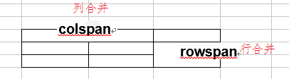  

1. 删除要合并的格子, 只留一个(最前方的那一个)
2. 如果是行合并设置rowspan, 如果是列合并设置colspan, 几个合并 值就是几

```html
<!DOCTYPE html>
<html lang="en">
<head>
    <meta charset="UTF-8">
    <title>02_ 单元格合并</title>
</head>
<body>
<!--
  colspan: 合并列
  rowspan: 合并行
  套路:
    1.确定要合并的单元格
    2.删除所有要合并的单元格,留下最前面的那个单元格
    3.确定是跨列合并,还是跨行合并
    3.确定后,在留下的单元格中设置对应的属性,属性值为合并的单元格数量
-->
<table border="1" width="50%" align="center">
    <tr>
        <td>1</td>
        <td>2</td>
        <td>3</td>
        <td>4</td>
        <td rowspan="3">5</td>
        <td>6</td>
        <td>7</td>
        <td>8</td>
    </tr>
    <tr>
        <td colspan="2">9</td>

        <td>11</td>
        <td>12</td>

        <td>14</td>
        <td>15</td>
        <td>16</td>
    </tr>
    <tr>
        <td>17</td>
        <td>18</td>
        <td colspan="2" rowspan="2">19</td>


        <td>22</td>
        <td>23</td>
        <td>24</td>
    </tr>
    <tr>
        <td>25</td>
        <td>26</td>


        <td>29</td>
        <td>30</td>
        <td>31</td>
        <td>32</td>
    </tr>
</table>

</body>
</html>
```


##### 3.4.3表格容易错的地方

```html
<!--1.就算只有1行1列, td不能少-->
<table>
    <tr></tr>
</table>

<!--2.合并之前, 每一行的列的个数应该一样-->
<table>
    <tr>
        <td></td>
        <td></td>
        <td></td>
    </tr>
    <tr>
        <td></td>
        <td></td>
        <td></td>
    </tr>
    <tr>
        <td></td>
        <td></td>
    </tr>
</table>

<!--3. table定义tr, tr里面定义td, td里面再放内容-->
<table>
    111
    <tr>
        222
        <td>
            333
        </td>
    </tr>
</table>
```

#### 3.2 黑马旅游首页练习

##### 3.2.1 分析

1. 创建8行的表格
2. 第1行(顶部图片): 定义img
3. 第2行(搜索): 嵌套1行3列的表格
4. 第3行(菜单): 嵌套1行9列的表格, 设置背景色, 每个格子里面定义超链接(居中)
5. 第4行(轮播图): 定义img
6. 第5行(线路部分): 嵌套3行4列的表格, 进行格子合并
7. 第6行(线路部分): 嵌套3行4列的表格, 进行格子合并
8. 第7行(底部图片): 定义img
9. 第8行(文字): 定义文字, 居中

##### 3.2.2 代码

```html
<!DOCTYPE html>
<html lang="en">
<head>
    <meta charset="UTF-8">
    <title>index</title>
</head>
<body>
<!--1.创建一个8行1列的表格-->
<table  width="98%" align="center">
    <!--2.第1行嵌套一个图片标签-->
    <tr>
        <td width="100%" height="100px">
            
        </td>
    </tr>
    <!--3.第2行嵌套一个1行3列的表格-->
    <tr>
        <td width="100%" height="100px">
            <table width="100%" height="100px">
                <tr>
                    <td></td>
                    <td></td>
                    <td></td>
                </tr>
            </table>
        </td>
    </tr>
    <!--4.第3行嵌套一个1行9列的表格-->
    <tr>
        <td width="100%" height="40px">
            <table width="100%" height="40px" >
                <tr bgcolor="#FFC900" align="center">
                    <td><a href="#">首页</a></td>
                    <td><a href="#">首页</a></td>
                    <td><a href="#">首页</a></td>
                    <td><a href="#">首页</a></td>
                    <td><a href="#">首页</a></td>
                    <td><a href="#">首页</a></td>
                    <td><a href="#">首页</a></td>
                    <td><a href="#">首页</a></td>
                    <td><a href="#">首页</a></td>
                </tr>
            </table>
        </td>
    </tr>
    <!--5.第4行嵌套一个图片标签-->
    <tr>
        <td width="100%" height="400px">
            
        </td>
    </tr>
    <!--6.第5行嵌套一个3行4列的表格-->
    <tr>
        <td width="100%" height="550px">
            <table width="100%" height="550px">
                <tr width="100%" height="50px">
                    <td colspan="4">
                        
                        <font>国内游</font>
                    </td>
                </tr>
                <tr>
                    <td rowspan="2" width="25%" height="500px">
                        
                    </td>
                    <td width="25%" height="250px" align="center">
                        
                        <p>上海直飞三亚5天4晚自由行(春节预售...</p>
                        <font color="red">¥899</font>
                    </td>
                    <td width="25%" height="250px" align="center">
                        
                        <p>上海直飞三亚5天4晚自由行(春节预售...</p>
                        <font color="red">¥899</font>
                    </td>
                    <td width="25%" height="250px" align="center">
                        
                        <p>上海直飞三亚5天4晚自由行(春节预售...</p>
                        <font color="red">¥899</font>
                    </td>
                </tr>
                <tr>
                    <td width="25%" height="250px" align="center">
                        
                        <p>上海直飞三亚5天4晚自由行(春节预售...</p>
                        <font color="red">¥899</font>
                    </td>
                    <td width="25%" height="250px" align="center">
                        
                        <p>上海直飞三亚5天4晚自由行(春节预售...</p>
                        <font color="red">¥899</font>
                    </td>
                    <td width="25%" height="250px" align="center">
                        
                        <p>上海直飞三亚5天4晚自由行(春节预售...</p>
                        <font color="red">¥899</font>
                    </td>
                </tr>
            </table>
        </td>
    </tr>
    <!--7.第6行嵌套一个3行4列的表格-->
    <tr>
        <td width="100%" height="550px">
            <table width="100%" height="550px">
                <tr width="100%" height="50px">
                    <td colspan="4">
                        
                        <font>国内游</font>
                    </td>
                </tr>
                <tr>
                    <td rowspan="2" width="25%" height="500px">
                        
                    </td>
                    <td width="25%" height="250px" align="center">
                        
                        <p>上海直飞三亚5天4晚自由行(春节预售...</p>
                        <font color="red">¥899</font>
                    </td>
                    <td width="25%" height="250px" align="center">
                        
                        <p>上海直飞三亚5天4晚自由行(春节预售...</p>
                        <font color="red">¥899</font>
                    </td>
                    <td width="25%" height="250px" align="center">
                        
                        <p>上海直飞三亚5天4晚自由行(春节预售...</p>
                        <font color="red">¥899</font>
                    </td>
                </tr>
                <tr>
                    <td width="25%" height="250px" align="center">
                        
                        <p>上海直飞三亚5天4晚自由行(春节预售...</p>
                        <font color="red">¥899</font>
                    </td>
                    <td width="25%" height="250px" align="center">
                        
                        <p>上海直飞三亚5天4晚自由行(春节预售...</p>
                        <font color="red">¥899</font>
                    </td>
                    <td width="25%" height="250px" align="center">
                        
                        <p>上海直飞三亚5天4晚自由行(春节预售...</p>
                        <font color="red">¥899</font>
                    </td>
                </tr>
            </table>
        </td>
    </tr>
    <!--8.第7行嵌套一个图片标签-->
    <tr>
        <td width="100%" height="80px">
            
        </td>
    </tr>
    <!--9.第9行嵌套一个字体标签-->
    <tr>
        <td width="100%" height="10px" align="center">
            <font color="gray" size="2">江苏传智播客教育科技股份有限公司 版权所有Copyright 2006-2018, All Rights Reserved 苏ICP备16007882</font>
        </td>
    </tr>
</table>

</body>
</html>
```

### 4. 小结

1. 表格标签

```
<table border="边框" width="宽度" height="高度" align="居左,中,右" bgcolor="背景色">
	<tr bgcolor="背景色">
		<td bgcolor="背景色" rowspan='行合并' colspan='列合并'></td>
	</tr>
</table>
```

2. 格子合并口诀
   + 删除要合并的格子, 只留一个【最前面的那一个】
   + 如果是行合并就是设置rowspan, 如果是列合并就设置colspan, 几个合并值就是几

## 练习-表单标签练习---重点

### 1. 目标

 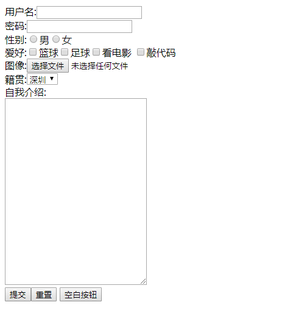

### 2. 分析

* 表单的基本使用
* form表单通用属性name和value
* form表单标签的action和method属性
* 设置表单元素的默认值
* input标签的type属性扩展

### 3. 讲解

#### 表单的基本使用

```html
<!DOCTYPE html>
<html lang="en">
<head>
    <meta charset="UTF-8">
    <title>01_表单标签元素</title>
</head>
<body>
<!--
表单:表单是一个包含表单元素标签的区域。
作用:用来提交数据到服务器(后台)
表单标签: form
表单元素标签:
    input标签:输入框
        type属性: 类别
            text:文本输入框
            password:密码输入框
            radio:单选框
            checkbox:复选框
            file:上传文件
            submit:提交按钮
            reset:重置按钮
            button:按钮
            hidden:隐藏

    select标签:下拉框
        option标签:下拉选项
    textarea标签:文本域
        cols属性: 列数
        rows属性: 行数
-->
<form>
    隐藏属性:<input type="hidden" value="1"><br/>
    用户名:<input type="text"><br/>
    密码:<input type="password"><br/>
    性别:<input type="radio">男 <input type="radio">女<br/>
    爱好:<input type="checkbox">篮球
         <input type="checkbox">足球
         <input type="checkbox">看电影
         <input type="checkbox">敲代码<br/>
    图像:<input type="file"><br/>
    籍贯:<select>
            <option>深圳</option>
            <option>广州</option>
            <option>东莞</option>
            <option>惠州</option>
        </select><br/>
    自我介绍:<br/>
        <textarea cols="20px" rows="15px">

        </textarea>
        <br/>
    <input type="submit">
    <input type="reset">
    <input type="button" value="空白按钮">

</form>

</body>
</html>
```

#### form表单通用属性name和value【重点】

```html
<!DOCTYPE html>
<html lang="en">
<head>
    <meta charset="UTF-8">
    <title>02_form表单通用属性name和value</title>
</head>
<body>
<!--
表单元素标签的name属性:
    1.为单选框和复选框分组
    2.作为key提交数据到后台(服务器),后台(服务器)会以name属性的值作为键去获取对应的值,如果表单元素标签没有设置name属性,后台是无法获取表单标签中输入的值
表单元素标签的value属性:
    - 给按钮起名字
    - 设置提交到服务器的值  name=value
-->
<form>
    隐藏属性:<input type="hidden" value="1"><br/>
    用户名:<input type="text" name="username"><br/>
    密码:<input type="password" name="password"><br/>
    性别:<input type="radio" name="sex" value="boy">男 <input type="radio" name="sex" value="girl">女<br/>
    爱好:<input type="checkbox" name="hobby" value="basketball">篮球
    <input type="checkbox" name="hobby" value="football">足球
    <input type="checkbox" name="hobby" value="film">看电影
    <input type="checkbox" name="hobby" value="code">敲代码<br/>
    图像:<input type="file" name="fileName"><br/>
    籍贯:<select name="jiGuan">
            <option value="sz">深圳</option>
            <option value="gz">广州</option>
            <option value="dg">东莞</option>
            <option value="hz">惠州</option>
        </select><br/>
    自我介绍:<br/>
    <textarea cols="20px" rows="15px" name="text">

        </textarea>
    <br/>
    <input type="submit">
    <input type="reset">
    <input type="button" value="空白按钮">

</form>

</body>
</html>
```

#### form表单标签的action和method属性

```html
<!DOCTYPE html>
<html lang="en">
<head>
    <meta charset="UTF-8">
    <title>03_form表单标签的action和method属性</title>
</head>
<body>
<!--
form表单常用属性
	action:设置提交路径,路径可以是本地路径,也可以是网络路径,默认是当前页面,#
	method:设置提交方式,常用的是get和post. 默认就是get
	
get和post区别
1. get方式提交的数据(请求参数)在地址栏可见(拼接在请求的路径后面), post方式不可见,提交的数据在请求体中
2. get方式相对不安全, post方式相当安全一些
3. get方式对提交的数据(请求参数)的大小有限制的, post方式没有限制的
-->
<form action="#" method="post">
    隐藏属性:<input type="hidden" value="1"><br/>
    用户名:<input type="text" name="username"><br/>
    密码:<input type="password" name="password"><br/>
    性别:<input type="radio" name="sex" value="boy">男 <input type="radio" name="sex" value="girl">女<br/>
    爱好:<input type="checkbox" name="hobby" value="basketball">篮球
    <input type="checkbox" name="hobby" value="football">足球
    <input type="checkbox" name="hobby" value="film">看电影
    <input type="checkbox" name="hobby" value="code">敲代码<br/>
    图像:<input type="file" name="fileName"><br/>
    籍贯:<select name="jiGuan">
    <option value="sz">深圳</option>
    <option value="gz">广州</option>
    <option value="dg">东莞</option>
    <option value="hz">惠州</option>
</select><br/>
    自我介绍:<br/>
    <textarea cols="20px" rows="15px" name="text">

        </textarea>
    <br/>
    <input type="submit">
    <input type="reset">
    <input type="button" value="空白按钮">

</form>

</body>
</html>
```

#### 设置表单元素的默认值【重点】

```html
<!DOCTYPE html>
<html lang="en">
<head>
    <meta charset="UTF-8">
    <title>04_设置表单元素的默认值</title>
</head>
<body>
<!--
    text,password: 通过value属性来设置默认值
    单选框\复选框: 通过checked设置默认值
    下拉框: 通过selected设置默认值
    textarea: 直接写文本
-->
<form action="#" method="post">
    隐藏属性:<input type="hidden" value="1"><br/>
    用户名:<input type="text" name="username" value="admin"><br/>
    密码:<input type="password" name="password" value="123456"><br/>
    性别:<input type="radio" name="sex" value="boy" checked="checked">男 <input type="radio" name="sex" value="girl">女<br/>
    爱好:<input type="checkbox" name="hobby" value="basketball" checked="checked">篮球
    <input type="checkbox" name="hobby" value="football">足球
    <input type="checkbox" name="hobby" value="film">看电影
    <input type="checkbox" name="hobby" value="code" checked="checked">敲代码<br/>
    图像:<input type="file" name="fileName"><br/>
    籍贯:<select name="jiGuan">
    <option value="sz">深圳</option>
    <option value="gz">广州</option>
    <option value="dg" selected="selected">东莞</option>
    <option value="hz">惠州</option>
    </select><br/>
    自我介绍:<br/>
    <textarea cols="20px" rows="15px" name="text">I like Java...</textarea>
    <br/>
    <input type="submit">
    <input type="reset">
    <input type="button" value="空白按钮">

</form>
</body>
</html>
```

#### input标签的type属性扩展

```html
<!DOCTYPE html>
<html lang="en">
<head>
    <meta charset="UTF-8">
    <title>05_扩展</title>
</head>
<body>
<!--
input标签的type属性扩展
-->
<form>
   <input type="color"/>
    <br/>
    <input type="date">
    <br/>
    <input type="email">
</form>
<hr/>
<!--
input标签的placeholder属性
-->
<form>
    用户名:
        <input type="text" placeholder="请输入用户名"/>
        <br/>
    密码:
        <input type="password" placeholder="请输入密码"/>

</form>

</body>
</html>
```

### 4.小结

- 表单元素标签一定要设置name属性,否则无法提交数据到服务器

## 扩展-html案例

### 1. 目标

- [ ] 能够了解扩展的hmtl案例

### 2. 路径

1. 媒体标签
2. 回到顶部
3. 图片链接
4. 详情和概要标签

### 3. 讲解

#### 3.1 媒体标签

##### 3.1.1 音频标签`audio`

###### 语法

* `<audio>`：用于播放声音，比如音乐或其他音频流，是 HTML 5 的新标签。

* 提示：可以在开始标签和结束标签之间放置文本内容，这样老的浏览器就可以显示出不支持该标签的信息
* 常用属性有

| 属性名     | 取值       | 默认值     | 描述                                                         |
| ---------- | ---------- | ---------- | ------------------------------------------------------------ |
| `src`      | URL        |            | 音频资源的路径                                               |
| `autoplay` | `autoplay` | `autoplay` | 音频准备就绪后自动播放                                       |
| `controls` | `controls` | `controls` | 显示控件，比如播放按钮。                                     |
| `loop`     | `loop`     | `loop`     | 表示循环播放                                                 |
| `preload`  | `preload`  | `preload`  | 音频在页面加载时进行预加载。<br />如果使用 "autoplay"，则忽略该属性。 |

###### 示例

```html
<!DOCTYPE html>
<html lang="en">
<head>
    <meta charset="UTF-8">
    <title>01_音频标签audio</title>
</head>
<body>
<audio src="../audio/b.mp3" controls="controls"></audio>

</body>
</html>
```

* 效果

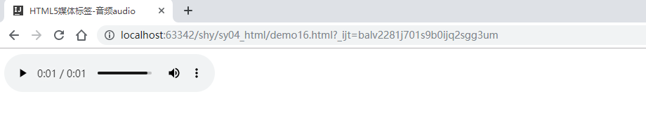

##### 3.1.2 视频标签`video`

###### 语法

* `<video>` 标签用于播放视频，比如电影片段或其他视频流，是 HTML 5 的新标签。
* 提示：可以在开始标签和结束标签之间放置文本内容，这样老的浏览器就可以显示出不支持该标签的信息

* 常用属性

| 属性名     | 取值       | 默认值     | 描述                                                         |
| ---------- | ---------- | ---------- | ------------------------------------------------------------ |
| `src`      | *URL*      |            | 要播放的视频的 URL。                                         |
| `width`    |            |            | 设置视频播放器的宽度。                                       |
| `height`   |            |            | 设置视频播放器的高度。                                       |
| `autoplay` | `autoplay` | `autoplay` | 视频在就绪后自动播放。                                       |
| `controls` | `controls` | `controls` | 显示控件，比如播放按钮。                                     |
| `loop`     | `loop`     | `loop`     | 如果出现该属性，则当媒介文件完成播放后再次开始播放。         |
| `preload`  | `preload`  | `preload`  | 视频在页面加载时进行加载。<br />如果使用 "autoplay"，则忽略该属性。 |
| `muted`    | `muted`    | `muted`    | 规定视频的音频输出应该被静音。                               |
| `poster`   | *URL*      |            | 视频下载时显示的图像，或者视频播放前显示的图像。             |

###### 示例

```html
<!DOCTYPE html>
<html lang="en">
<head>
    <meta charset="UTF-8">
    <title>02_视频标签video</title>
</head>
<body>
<video src="../audio/a.mp4" controls="controls"></video>
</body>
</html>
```

#### 3.2回到顶部


​		锚一般指船锚，是锚泊设备的主要部件。铁制的停船器具，用铁链连在船上，把锚抛在水底，可以使船停稳。

​		**在html里面锚点的作用: 通过a标签跳转到指定的位置.**

```html
<!DOCTYPE html>
<html lang="en">
<head>
    <meta charset="UTF-8">
    <title>Title</title>
</head>
<body>
    <a id="aId"></a>
    <p>111</p>
    <p>111</p>
    <p>111</p>
    <p>111</p>
    <p>111</p>
    <p>111</p>
    <p>111</p>
    <p>111</p>
    <p>111</p>
    <p>111</p>
    <p>111</p>
    <p>111</p>
    <p>111</p>


    <p>111</p>
    <p>111</p>
    <p>111</p>
    <p>111</p>
    <p>111</p>
    <a href="#aId">回到顶部</a>

</body>
</html>
```

#### 3.3图片链接

```html
<!DOCTYPE html>
<html lang="en">
<head>
    <meta charset="UTF-8">
    <title>Title</title>
</head>
<body>

<a href="http://www.baidu.com">
    <br/>
    百度
    
</a>

</body>
</html>
```

#### 3.4详情和概要标签

利用summary标签来描述概要信息, 利用details标签来描述详情信息. 默认情况下是折叠展示, 想看见详情必须点击

```html
<details>
    <summary>概要信息</summary>
    详情信息
</details>
```

#### 3.5 HTML5中新增的type类型

```
<input type="xxx"/>
```

 注：不同的浏览器支持上有差异，有些浏览器依然不支持

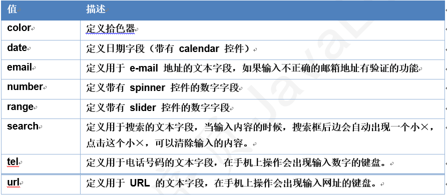

#### 3.6.placeholder:用户提示

### 4. 小结


# 第三章-CSS入门

## 3.1 div和span 

#### 什么是div和span	

​	div是html里面的一个标签`<div></div>` .  没有特定的含义, 作为容器. 一般用于配合css完成网页的基本布局,

​	span也是一个标签`<span></span>`,没有特定含义,一般作为文本容器 

#### div和span的区别

1. **div 就是一个标签. 是一个容器, 块级元素(自动换行), div内部可以放任何标签(body,html等不行)**
2. **span就是一个标签.  是一个容器, 行内元素(不换行), span标签中只能嵌套文本/图片/超链接**

```html
<!DOCTYPE html>
<html lang="en">
<head>
    <meta charset="UTF-8">
    <title>01_div和span</title>
</head>
<body>
<!--
1.div和span
1.1什么是div和spn
	div是html里面的一个标签<div></div>.  没有特定的含义,作为容器. 一般用于配合css完成网页的基本布局,
	span也是一个标签,没有特定含义,一般作为文本容器

1.2div和span的区别
	div是块级元素会独占一行,span是行内元素不会独占一行
	div中可以嵌套其它所有的标签, span标签中只能嵌套文本/图片/超链接

    块级元素: 默认占满一行的元素就是块级元素,例如:div  p
    行内元素: 默认不会占满一行,内容多大就自动多大  例如: font  a
-->
<div>div一</div>
<div>div二</div>

<span>span1</span>
<span>span2</span>


</body>
</html>
```


## 3.2 CSS介绍

#### 什么是CSS

- 层叠样式表
  + 层叠: 样式层层叠加 eg:刷墙 
  + 样式表: 样式的集合

> 学习html就是学习标签, 学习CSS主要学习样式(属性),选择器

#### CSS的作用

+ 美化页面,修饰页面  
+ HTML负责内容(hello),CSS负责样式(颜色,字体大小...)

```html
<font color="red" size="7">hello</font>
```

+ html当做毛坯房, CSS当做装修

#### 为什么要学习CSS  

- 我们在上次课中已经遇到了一些样式的问题, font标签的字体不能比1还小不能比7还大, 超链接标签的下划线去不掉, 大量进行嵌套来设置样式(eg: 段落里面嵌套font, 在font里面再设置color属性)

- 通过标签来修改样式的缺点:

  ​	1.需要记忆哪些标签有哪些属性, 如果该标签没有这个属性, 那么设置了也没有效果

  ​	2.当需求变更时我们需要修改大量的代码才能满足现有的需求

- 所以在企业开发中修改样式都是交给CSS来做,通过CSS来修改样式的好处:

  ​	1.不用记忆哪些属性属于哪个标签

  ​	2.当需求变更时我们不需要修改大量的代码就可以满足需求

```html
<!DOCTYPE html>
<html lang="en">
<head>
    <meta charset="UTF-8">
    <title>02_CSS概述和体验</title>
    <style>
        font[color]{
            color: blue;
        }

        font[size]{
            font-size: 100px;
        }

        a,font{
            text-decoration: line-through;
        }
        p{
            color: red;
        }
        div{
            border: 1px red dashed;
        }
    </style>
</head>
<body>
<div>
    div
</div>
<!--为什么要学css-->
<!--把所有的font标签的color属性值改成蓝色:大量修改代码,维护性太差  css可以解决问题-->
<font color="red">字体标签</font>
<font color="red">字体标签</font>
<font color="red">字体标签</font>
<font color="red">字体标签</font>
<font color="red">字体标签</font>
<font color="red">字体标签</font>
<br/>

<!--font标签中size属性的取值范围:1-7  如果想要让字体更大,就实现不了   css可以解决问题-->
<font size="7">字体</font>
<br/>

<!--a标签的下划线无法去除   css可以解决问题-->
<a href="#">百度</a>
<br/>

<!--段落标签,如果想要设置段落标签中的文本设置为红色,就必须嵌套font标签,如果不想嵌套,实现不了   css可以解决问题-->
<p>段落</p>

</body>
</html>
```


#### CSS语法

```
选择器{
	属性:属性值 属性值;
	...
	属性:属性值 属性值
}
```

**注意**

- 属性和属性值用:连接
- 如果有多个属性值用空格隔开
- 如果有多个属性,属性和属性之间用;隔开  最后一个;可以不写


# 第四章-CSS进阶

## 4.1 CSS引入方式

#### 概述

* HTML是一种语言；CSS也是一种语言。如果想要CSS能够修饰HTML的样式，就必须把CSS引入到HTML中。即：要解决 把CSS代码写在什么地方 的问题
* 引入的方式有：
  * 内联样式：把CSS代码内嵌到HTML代码里,通过标签的style属性来结合
  * 内部样式：把CSS代码写在HTML文档内部,通过style标签来结合
  * 外部样式：把CSS代码写在独立的CSS文件里,通过link标签结合

#### 通过标签的style属性来结合【了解】 

```html
<!--通过style属性-->
<p style="属性名称:属性值;..."></p>
```

#### 通过style标签来结合【掌握】  

```html
<head>
	<style type="text/css">
        标签名称{
            属性名称: 属性对应的值;
           	
        }
	</style>
</head>

注意点:
	1.style标签必须写在head标签的开始标签和结束标签之间(也就是必须和title标签是兄弟关系)
	2.style标签中的type属性其实可以不用写, 默认就是type="text/css"
	3.设置样式时必须按照固定的格式来设置. key: value; 其中:不能省略, 分号大多数情况下也不能省略
```

#### 通过link标签结合【掌握】

1. 创建一个css文件(后缀是css)
2. 通过link标签引入

```html
<head>
	<link rel="stylesheet" href="../../css/myCss.css" />
</head>

link标签属性:
	- href:css文件路径
	- rel: stylesheet  必须要有,否则引入的样式无法使用
```

####  三种结合方式优先级

​	就近原则(相对于代码,也就是要修饰的标签)

## 4.2 CSS基本选择器

#### 基本选择器语法

| 选择器     | 描述                            | 语法         | 示例                    |
| ---------- | ------------------------------- | ------------ | ----------------------- |
| 标签选择器 | 根据HTML标签名称选择标签        | `标签名称{}` | `div{ color:red; }`     |
| ID选择器   | 根据id属性值选择标签            | `#id值{}`    | `#d1 { color:blue; }`   |
| 类选择器   | 根据class属性值（类名）选择标签 | `.类名{}`    | `.c1 { color:yellow; }` |
| 通用选择器 | 选取所有标签                    | `*{}`        | `*{ color: pink;}`      |

```html
<!DOCTYPE html>
<html lang="en">
<head>
    <meta charset="UTF-8">
    <title>1_css的基本选择器</title>
    <style>
        font{
            color: red;
        }

        #pId{
            color: blue;
        }

        .c1{
            color: green;
        }

        *{
            color: blueviolet;
        }
    </style>
</head>
<body>
<!--选择器:是用来选择对应的标签,然后把css的样式作用到该标签上-->
<!--
基本选择器:
    标签选择器: 根据标签名来选择对应的标签                标签名
    id选择器:   根据标签的id属性值来选择对应的标签         #id属性值
    类选择器:   根据标签的class属性值来选择对应的标签      .class属性值
    通用选择器: 选择所有的标签                           *
-->
<font>字体标签1</font>
<font>字体标签2</font>
<font>字体标签3</font>
<font class="c1">字体标签4</font>

<p id="pId">段落1</p>
<p>段落2</p>

<p>段落11</p>
<p class="c1">段落22</p>
<p class="c1">段落33</p>
<p>段落44</p>

</body>
</html>
```


####  优先级

选择器优先级

* ID选择器 > 类选择器 > 标签选择器 > 通用选择器
* 如果优先级相同，那么就满足就近原则

```html
<!DOCTYPE html>
<html lang="en">
<head>
    <meta charset="UTF-8">
    <title>03_基本选择器的优先级</title>
    <style>
        /*#d1{
            color: red;
        }*/

       /* .c1{
            color: green;
        }*/

        p{
            color: blue;
        }

        *{
            color: yellow;
        }

    </style>
</head>
<body>
<!--
id选择器>类选择器>元素选择器>通用选择器
-->
<p class="c1" id="d1">段落</p>

</body>
</html>
```


## 4.3 CSS扩展选择器

#### 组合选择器

* 多个基本选择器的组合，可以更灵活的选取标签

| 选择器     | 描述                     | 语法                  | 示例                      |
| ---------- | ------------------------ | --------------------- | ------------------------- |
| 层级选择器 | 根据HTML标签名称选择标签 | `祖先 后代`           | `div a{ }`                |
| 属性选择器 | 根据指定属性的值筛选元素 | `[属性='值']`         | `input[type='text'] {  }` |
| 并集选择器 | 多个选择器的结果进行合并 | `选择器1,选择器2,...` | `.c1, span {  }`          |

```html
<!DOCTYPE html>
<html lang="en">
<head>
    <meta charset="UTF-8">
    <title>1_css的组合选择器</title>
    <style>
        div font{
            color: red;
        }

        p font{
            color: green;
        }

        input[type='text']{
            background-color: red;
        }

        #divId,span{
            color: blue;
        }

    </style>
</head>
<body>
<!--
组合选择器:多个基本选择器的组合，可以更灵活的选取标签
    层级选择器           根据HTML标签名称选择标签          祖先 后代
    属性选择器           根据指定属性的值筛选元素          [属性='值']
    并集选择器           多个选择器的结果进行合并          选择器1,选择器2,...
-->
<div>
    <font>字体标签1---红色</font>
    <p>
        <font>字体标签2----绿色</font>
    </p>
</div>

<font>字体标签3</font>

<hr/>

<form>
    用户名:<input type="text"><br/>
    密码:<input type="password">
</form>

<hr/>
<div id="divId">div</div>
<span>span</span>

</body>
</html>
```


#### 伪类选择器【了解】

* 了解几个超链接相关的伪类选择器

| 选择器     | 描述                 | 示例          |
| ---------- | -------------------- | ------------- |
| `:link`    | 选择正常状态的超链接 | `a:link{}`    |
| `:visited` | 选择被访问过的超链接 | `a:visited{}` |
| `:hover`   | 选择鼠标悬停的超链接 | `a:hover{}`   |
| `:active`  | 选择鼠标按下的超链接 | `a:active{}`  |

```html
<!DOCTYPE html>
<html lang="en">
<head>
    <meta charset="UTF-8">
    <title>02_伪类选择器【了解】</title>
    <style>
        a:link {color: red}	/* 未访问的链接 */
        a:visited {color: green}	/* 已访问的链接 */
        a:hover {color: blue}	/* 鼠标移动到链接上 */
        a:active {color: yellow}	/* 选定的链接 */

    </style>
</head>
<body>
<a href="#">百度</a>
</body>
</html>
```


## 4.4 CSS常用属性

#### 背景属性

##### 介绍

| **功能**     | **属性名**            | **属性取值**                                                 |
| ------------ | --------------------- | ------------------------------------------------------------ |
| **背景色**   | `background-color`    | 1. 颜色常量，如：red  <br />2. 使用十六进制，如：#ABC <br />3. 红绿蓝  使用 rgb(红,绿,蓝) |
| **背景图片** | `background-image`    | `url(图片的路径)`                                            |
| **平铺方式** | `background-repeat`   | `repeat` 默认。背景图像将在垂直方向和水平方向重复 <br />`repeat-x` 背景图像将在水平方向重复。   <br />`repeat-y` 背景图像将在垂直方向重复。    <br />`no-repeat `背景图像将仅显示一次。 |
| **背景位置** | `background-position` | left top                                                     |

##### 示例

```html
<!DOCTYPE html>
<html lang="en">
<head>
    <meta charset="UTF-8">
    <title>CSS常用属性-背景</title>
    <style>
        /*设置整个页面的背景样式*/
        body{
            /*背景图片*/
            background-image: url("img/little_mm.jpg");
            /*平铺方式*/
            background-repeat: repeat;
        }
    </style>
</head>
<body>

    <div>页面内容</div>

</body>
</html>
```

* 效果

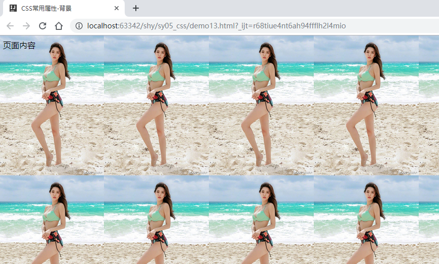

#### 文本样式

##### 介绍

| **功能**     | **属性名**        | **属性取值**                                                 |
| ------------ | ----------------- | ------------------------------------------------------------ |
| **颜色**     | `color`           | 颜色                                                         |
| **设置行高** | `line-height`     | 像素                                                         |
| **文字修饰** | `text-decoration` | `underline` 下划线  <br /> `overline` 上划线 <br />` line-through`  删除线 <br />`none` 不要线条 |
| **文本缩进** | `text-indent`     | 用于缩进文本，可以使用em单位。                               |
| **文本对齐** | `text-align`      | `left` 把文本排列到左边。    <br />`right` 把文本排列到右边。    <br />`center` 把文本排列到中间。<br />默认值：由浏览器决定。 |

##### 示例

```html
<!DOCTYPE html>
<html lang="en">
<head>
    <meta charset="UTF-8">
    <title>CSS常用属性-文本</title>
    <style>
        p{
            /*首行缩进：2个字符*/
            text-indent: 2em;
            /*文字颜色：绿色*/
            color: green;
        }
        a{
            /*超链接 不显示下划线*/
            text-decoration: none;
        }
    </style>
</head>
<body>

<p>
    "中关村黑马程序员训练营"是由<a href="http://www.itcast.cn">传智播客</a>联合中关村软件园、CSDN， 并委托传智播客进行教学实施的软件开发高端培训机构，致力于服务各大软件企业，解决当前软件开发技术飞速发展， 而企业招不到优秀人才的困扰。
</p>
<p>
    目前，“中关村黑马程序员训练营”已成长为行业“学员质量好、课程内容深、企业满意”的移动开发高端训练基地， 并被评为中关村软件园重点扶持人才企业。
</p>

</body>
</html>
```

* 效果

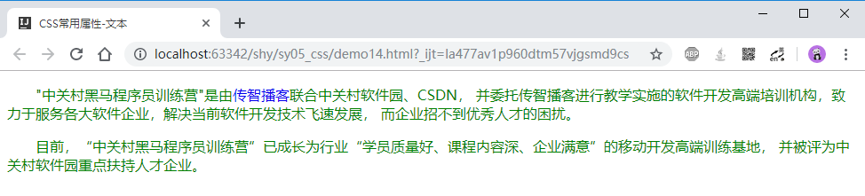

####  字体属性

#####  介绍

| 功能         | 属性名        | 作用                                                         |
| ------------ | ------------- | ------------------------------------------------------------ |
| **字体名**   | `font-family` | 设置字体，本机必须要有这种字体                               |
| **设置大小** | `font-size`   | 像素                                                         |
| **设置样式** | `font-style`  | `italic` 斜体<br />`normal` 默认值。浏览器显示一个标准的字体样式。 |
| **设置粗细** | `font-weight` | `bolder`加粗                                                 |

#####  示例

```html
<!DOCTYPE html>
<html lang="en">
<head>
    <meta charset="UTF-8">
    <title>CSS常用属性-字体</title>
    <style>
        span{
            /*字体：幼圆*/
            font-family: 幼圆;
            /*大小：40px*/
            font-size: 40px;
            /*字体：斜体*/
            font-style: italic;
            /*加粗显示*/
            font-weight: bolder;
        }
    </style>
</head>
<body>
    <span>黑马程序员</span>
</body>
</html>
```

* 效果

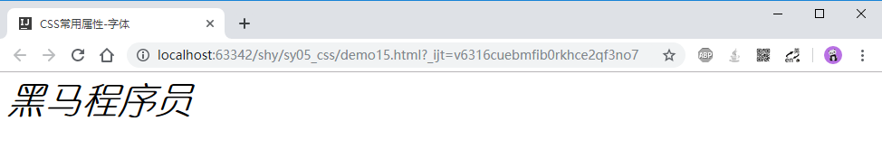

# 总结

```java
必须练习: 
	黑马旅游网的首页
    表单标签------能提交数据(地址栏有提交的数据)----->重点练习
    基本选择器和组合选择器的使用
        
- 能够使用h1~h6、hr、p、br 等与文本有关的标签
    hn: 标题标签 n:1-6
    hr: 下划线
    p: 段落
    br; 换行
    b:加粗
    i:斜体
        
- 能够使用有序列表ul-li和无序列表ol-li显示列表内容
      ul-li: 无序列表  type属性
      ol-li: 有序列表  type属性 start属性
          
- 能够使用图片img标签把图片显示在页面中
     img: src属性,width属性,height属性(像素,百分比),title,alt
         
- 能够使用超链接a标签跳转到一个新页面
    a: href属性  target属性
        
- 能够使用table、tr、td标签定义表格
      table: 表格   border边框  width宽  height高 align对齐方式 
       tr; 行	  align对齐方式 
       td; 列      colspan  rowspan 合并单元格   align对齐方式 
      
- 能够使用表单form标签创建表单
       <form>input  select  textarea</form>
- 能够使用表单中常用的input标签创建输入项
      type属性:text,password,radio,CheckBox,file,submit,reset,hidden,date,color...
      一定要设置name属性,否则无法提交数据到服务器
          
- 能够使用表单select标签定义下拉选择输入项
       option
- 能够使用表单textarea标签定义文本域
        rows  cols 属性,设置行和列
          
- 能够使用CSS的基本选择器选择元素
      标签选择器\类选择器\id选择器\通用选择器
       选择器{
          属性名:属性值 属性值;
          ....
       }
- 能够使用常见的CSS属性
	背景属性   文本样式  字体属性
```

